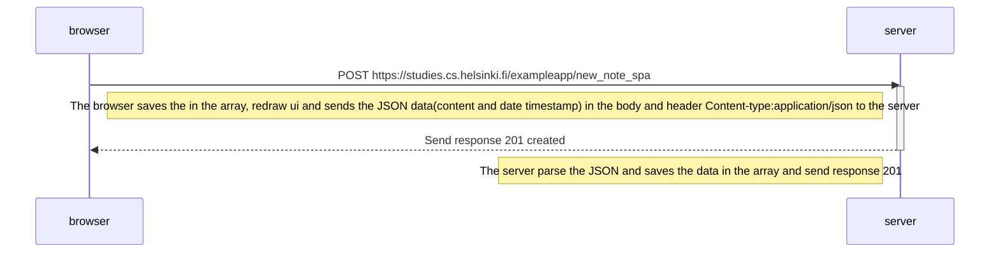

```mermaid
sequenceDiagram
    participant browser
    participant server

    browser->>server: POST https://studies.cs.helsinki.fi/exampleapp/new_note_spa
    activate server
    Note right of browser: The browser saves the  in the array, redraw ui and sends the JSON data(content and date timestamp) in the body and header Content-type:application/json to the server
    server-->>browser: Send response 201 created
    deactivate server
    Note left of server: The server parse the JSON and saves the data in the array and send response 201
```
